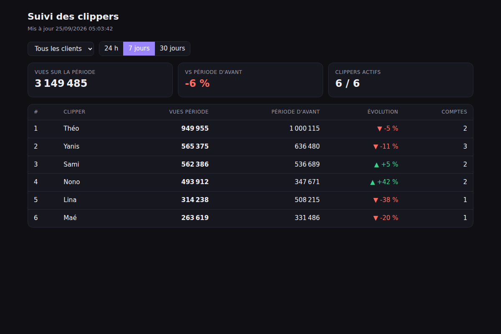

# Lune Tracker : suivi des vues des clippers

Un bot Discord et un dashboard web qui suivent en continu les vues des clippers (TikTok, Instagram, YouTube),
client par client (Loann, BeOne…), et qui relancent automatiquement ceux qui décrochent.



## Ce que ça fait

| Brique | Rôle |
| --- | --- |
| **Salon COMPTES** | Un clipper poste ses liens de profil (`tiktok.com/@…`, `instagram.com/…`, `youtube.com/@…`). Le bot les rattache au clipper et au client du salon, puis confirme avec ✅. Un compte déjà pris par quelqu'un d'autre est refusé (⚠️). |
| **Collecte** | Toutes les `COLLECT_INTERVAL_MINUTES`, le bot récupère les vidéos récentes de chaque compte et historise leurs vues. |
| **Stats** | Vues gagnées sur 24 h / 7 j / 30 j, comparées à la période d'avant (hier, semaine dernière, mois dernier). |
| **Rémunération** | Chaque client a son tarif (€ / 1 000 vues), un minimum de vues et un plafond optionnel. |
| **Relances** | Ping du clipper s'il n'a rien posté depuis `INACTIVITY_DAYS` jours ou si ses vues chutent de plus de `DROP_THRESHOLD_PERCENT` %. Cooldown pour éviter le spam. |
| **Dashboard web** | Vue Agence (KPIs, courbe, alertes, classement, export CSV), Clippers, Classement, profil clipper (vidéos, retours, score, strikes), Inspiration (top 10), Management, Rémunération (barème en cascade), Paramètres. |

### Comment les vues sont comptées

- À l'enregistrement d'un compte, la première collecte sert de **référence** : les vues d'avant ne comptent pas.
- À chaque collecte on enregistre le **total du compte**, c'est-à-dire la somme des dernières vues connues de *toutes* les vidéos déjà vues,
  même celles qui sont sorties du lot récupéré. Une vieille vidéo qui disparaît de l'API ne fait donc pas baisser le total.
- Les « vues gagnées » sur une période correspondent à la différence entre le total au début et le total à la fin de la période.
- Les fenêtres sont **glissantes** (les dernières 24 h comparées aux 24 h d'avant, et ainsi de suite). On évite ainsi de comparer une journée entamée à une journée complète.
- Si le suivi est trop récent pour couvrir la période précédente, la comparaison est marquée *partielle* et ne déclenche pas de relance « baisse ».

## Mise en ligne

👉 Guide pas à pas (Discord, YouTube, Apify, Railway) : **[DEPLOY.md](DEPLOY.md)**.
Le `Dockerfile` marche sur n'importe quel hébergeur Docker, à condition de monter un volume persistant sur `/data`.

## Démarrage rapide (sans Discord ni APIs)

```bash
cd tracker
npm install
cp .env.example .env      # FETCHER_MODE=mock par défaut
npm run seed              # 2 clients, 6 clippers, 60 jours d'historique simulé
npm run dev               # http://localhost:3000
```

## Brancher Discord

1. Crée une application sur <https://discord.com/developers/applications>, puis dans **Bot** :
   - copie le token dans `DISCORD_TOKEN` ;
   - active **Message Content Intent** (nécessaire pour lire les liens du salon COMPTES).
2. Copie l'Application ID dans `DISCORD_CLIENT_ID` et l'ID du serveur dans `DISCORD_GUILD_ID`.
3. Invite le bot avec les scopes `bot` et `applications.commands`, et les permissions *View Channel, Send Messages, Add Reactions, Read Message History*.
4. Les slash commands s'enregistrent toutes seules au démarrage (`npm run register-commands` pour le faire à la main).
5. Sur Discord : `/client nom:Loann tarif:1 salon:#comptes-loann` (une fois par client).

### Commandes

| Commande | Qui | Effet |
| --- | --- | --- |
| `/stats [membre]` | tous | Vues 24 h / 7 j / 30 j et évolution, détail par compte |
| `/classement [client] [periode]` | tous | Top 15 avec la rémunération estimée (client par défaut : celui du salon) |
| `/client nom tarif [salon] [min_vues] [plafond]` | *Gérer le serveur* | Crée ou modifie un client et ses règles |
| `/retirer-compte lien` | tous | Arrête le suivi d'un de ses comptes |

## Brancher les vraies stats (`FETCHER_MODE=live`)

| Plateforme | Source | Variable | Coût indicatif |
| --- | --- | --- | --- |
| YouTube | [YouTube Data API v3](https://developers.google.com/youtube/v3) (officielle) | `YOUTUBE_API_KEY` | Gratuit, environ 3 unités de quota par compte (10 000 par jour) |
| TikTok | Actor Apify `clockworks~tiktok-scraper` | `APIFY_TOKEN` | Payant à l'usage |
| Instagram | Actor Apify `apify~instagram-reel-scraper` | `APIFY_TOKEN` | Payant à l'usage |

TikTok et Instagram ne proposent pas d'API publique pour lire les stats d'un compte tiers : leurs APIs officielles demandent
que chaque clipper connecte son compte en OAuth. On passe donc par un scraper. **À vérifier avant la prod** : les
noms d'actors et les champs de sortie (`playCount`, `videoPlayCount`…) dans `src/platforms/apify.ts`, car ils changent parfois.
Pour changer de fournisseur, il suffit d'implémenter l'interface `PlatformFetcher` (`src/platforms/types.ts`).

## Architecture

```
src/
  index.ts              point d'entrée : web + bot + tâches planifiées
  config.ts             variables d'environnement validées (zod)
  domain/               logique pure, sans I/O, entièrement testée
    links.ts            parsing des liens TikTok / Insta / YouTube
    stats.ts            vues gagnées, comparaisons de périodes
    rewards.ts          rémunération par client
    relance.ts          règles d'inactivité / de baisse + messages
  db/                   SQLite (better-sqlite3) : schéma, migrations, requêtes
  platforms/            récupération des stats (YouTube, Apify, mock)
  services/analytics.ts assemble la DB et le domaine : classements, détail clipper
  jobs/                 collecte, relances, planificateur
  bot/                  discord.js : salon COMPTES, slash commands, envoi des relances
  services/agency.ts    tout ce que le dashboard affiche (périodes, score, rémunération, alertes…)
  web/server.ts         API JSON (Hono)
  web/app/              application du dashboard (HTML/CSS/JS sans build)
scripts/seed.ts         données de démo
test/                   vitest (unitaires et parcours complet)
```

### Score et rémunération

- **Score /100** : Production /40 (posts vs objectif/jour), Performance /30 (vues vs objectif/jour),
  Régularité /20 (jours avec au moins un post), Discipline /10 (−5 par strike). Objectifs réglables dans Paramètres.
- **Barème en cascade** : universel → agence → clipper, le plus précis existant s'applique en entier.
  Base par vue, primes (vues, posts, classement, régularité par paliers), malus strikes, plafond.

### API (toutes les routes acceptent `preset=today|7d|30d|all` ou `from`/`to` en ms, et `client=<id>`)

- `GET /api/overview` : KPIs, série par jour, alertes, classement
- `GET /api/leaderboard` · `GET /api/clippers/:id` · `GET /api/inspiration?week=<ms>` · `GET /api/export.csv`
- `GET /api/management` · `POST /api/clippers` · `PATCH|DELETE /api/clippers/:id`
- `POST /api/clippers/:id/strikes` · `DELETE /api/strikes/:id` · `POST /api/videos/:id/feedback`
- `GET /api/remuneration` · `GET|PUT|DELETE /api/rewards/:scope/:id` · `PUT /api/settings`
- `POST /api/clients` · `PATCH|DELETE /api/clients/:id` · `GET /api/discord/roles` · `POST /api/discord/import`
- `GET /healthz` (sans mot de passe)

Si `DASHBOARD_PASSWORD` est défini, tout le reste passe par une authentification basique (nom d'utilisateur libre).

## Scripts

```bash
npm run dev                # lancement avec rechargement automatique
npm test                   # tests
npm run typecheck
npm run build && npm start # production
```

## Pistes pour la suite

- Export CSV des paiements par client et par mois, puis validation et suivi des versements.
- Rôle Discord « Admin » pour voir le classement de tous les clients ; vue restreinte pour chaque clipper.
- Lien de connexion Discord (OAuth) sur le site pour que chaque clipper voie ses propres stats.
- Récap hebdo automatique posté dans le salon de chaque client.
